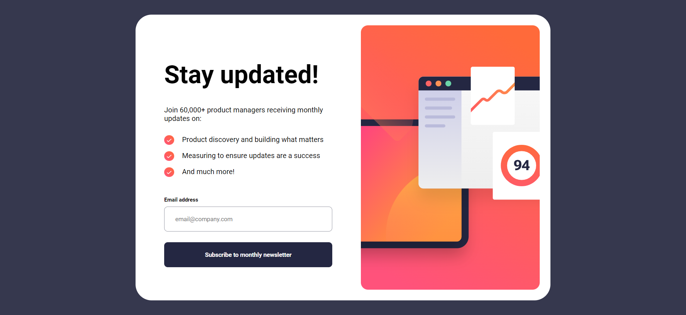

# Frontend Mentor - Newsletter sign-up form with success message solution

This is a solution to the [Newsletter sign-up form with success message challenge on Frontend Mentor](https://www.frontendmentor.io/challenges/newsletter-signup-form-with-success-message-3FC1AZbNrv).

## Table of contents

[Screenshot](#screenshot)

[Links](#links)

[Built with](#built-with)

### Screenshot

### Links

- [Github Pages](https://schismond.github.io/newsletter-sign-up/)

OR

- [Netlify](https://schismond-newsletter-sign-up.netlify.app)

### Built with

- Semantic HTML5 markup
- CSS custom properties
- Flexbox